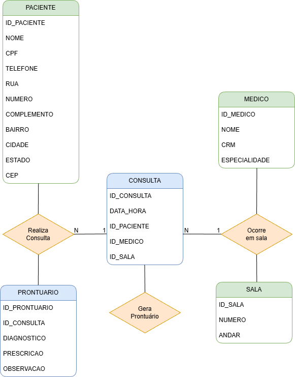

# 🏥 Sistema de Gestão para Clínica Médica Especializada “VidaPlena”


---

## 📌 Descrição do Projeto

Este repositório contém os scripts SQL da **Experiência Prática IV – Implementação e Manipulação de Dados**, referentes ao sistema de gestão da Clínica Médica Especializada **VidaPlena**, incluindo:

- Criação das tabelas do banco de dados (DDL)
- Inserção de dados iniciais (INSERT)
- Consultas SQL (SELECT)
- Atualizações (UPDATE)
- Exclusões (DELETE)

Todo o desenvolvimento foi realizado utilizando **PostgreSQL** e **PGAdmin**.

---

## 🧬 Modelo Conceitual (DER)

O Diagrama Entidade-Relacionamento utilizado como base para este projeto está disponível no diretório `docs`.



---

## 🗂 Estrutura do Repositório

```txt
.
├── docs/
│ ├── banner.png
│ ├── der.png
│ └── manual.md
│
├── sql/
│ ├── 01_create_tables.sql
│ ├── 02_insert_data.sql
│ ├── 03_select_queries.sql
│ ├── 04_updates.sql
│ └── 05_deletes.sql
│
└── README.md
```
---

## 🛠 Tecnologias Utilizadas

- **PostgreSQL 15+**
- **PGAdmin 4**
- Modelagem relacional
- Linguagem SQL (DDL + DML)
- Versionamento com Git e GitHub

---

## 📄 Scripts Disponíveis

### **1️⃣ Criação das Tabelas (DDL)**
Arquivo: `sql/01_create_tables.sql`  
Inclui a criação das tabelas:

- PACIENTE  
- MEDICO  
- SALA  
- CONSULTA  
- PRONTUARIO  

Com chaves primárias, estrangeiras e tipos adequados.

---

### **2️⃣ Inserção de Dados (DML – INSERT)**
Arquivo: `sql/02_insert_data.sql`  
Contém os comandos para inserir dados iniciais em todas as tabelas principais do sistema.

---

### **3️⃣ Consultas SQL (SELECT)**
Arquivo: `sql/03_select_queries.sql`  
Inclui consultas utilizando:

- WHERE  
- ORDER BY  
- LIMIT  
- JOIN  
- Filtros específicos  

---

### **4️⃣ Atualizações (UPDATE)**
Arquivo: `sql/04_updates.sql`  
Inclui ao menos 3 atualizações com condições.

---

### **5️⃣ Exclusões (DELETE)**
Arquivo: `sql/05_deletes.sql`  
Inclui ao menos 3 exclusões, respeitando integridade referencial.

---

## ▶️ Como Executar os Scripts

1. Abra o **PGAdmin 4**
2. Conecte-se ao seu servidor PostgreSQL
3. Crie um banco de dados, ex.:  


## :clubs: Para preparar um ambiente com o Docker
* **[Siga as instruções do manual](docs/manual.md)**